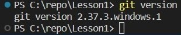

## **Инструкция по работе с git:**

*Скачать git можно по ссылке https://git-scm.com/*

# Шаг 0

Проверка исправности git-а при помощи команды `git --version`.

В случае успеха будет указана актуальная версия git-а, установленная на компьютере.

# Шаг 1

Необходимо инициировать новый репозиторий в рабочей папке. Для этого в командной строке терминала вводим команду `git init`. После чего должен появиться ответ об успешном создании нового репозитория.

*Initialized empty Git repository in C:/repo/Lesson1/.git/*

А в рабочей папке компьютера появится скрытая папка с именем **(.git)**

# Шаг 2

После создания файлов в репозитории необходимо добавить их в отслеживаемые. Для этого используется команда `git add 'имя файла'`.

# Шаг 3

Затем необходимо создать коммит для отслеживаемого файла. Для этого пишем команду `git commit -m "название коммита"`.

После чего на экране появится сообщение:

# Шаг 4

Проверка файлов репозитория осуществляется при помощи команды `git status`. 
В случае, если имеются несохранённые изменения файлов, появится сообщение:

# Шаг 5

Проверка версий осуществляется при помощи команды `git log`.

После ввода команды на экране появится список коммитов:

*Чтобы выйти из списка коммитов необходимо нажать клавишу Q на клавиатуре*
# Шаг 6

